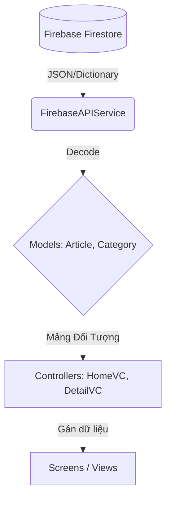

# 🗺 Bản đồ Luồng Dữ Liệu & Cơ Chế Hiển Thị (NewsApp)

Tài liệu này tổng hợp lại toàn bộ quá trình dữ liệu đi từ Database (Firebase) cho đến khi hiện lên màn hình (chữ, ảnh, video) để bạn dễ dàng nắm bắt cấu trúc.

---

## 1. Luồng tải dữ liệu tổng thể (Data Flow)

Dòng chảy dữ liệu tuân thủ nghiêm ngặt mô hình **MVC/Controller-Screen** mà chúng ta đã xây dựng:



1. **`FirebaseAPIService.swift` (Nơi cào dữ liệu):** 
   - Đọc dữ liệu thô từ Firebase.
   - Sử dụng `doc.data(as: Article.self)` để tự động ép kiểu dữ liệu từ trên mạng thành các đối tượng Swift (`Models`).
2. **`HomeViewController.swift` (Bộ não trung tâm):** 
   - Gọi API để lấy mảng `[Article]`.
   - Phân trang, chặn tải liên tục (`isLoadingMore`).
   - Ra lệnh cho `HomeScreen` (giao diện) cập nhật lại (`tableView.reloadData()`).

---

## 2. Cơ chế hiển thị Ảnh và Chữ trên thẻ bài báo (ArticleCell)

Vị trí file: `Views/ArticleCell.swift`

- **Luồng hiển thị Chữ (Text):**
  - Hàm `configure(with article: Article)` nhận dữ liệu.
  - Gán trực tiếp: `titleLabel.text = article.title`.
- **Luồng hiển thị Ảnh (Image):**
  - **Vấn đề:** Ảnh từ Firebase là dạng đường link URL (`https://...`), nếu dùng hàm tải mặc định của iOS nó sẽ làm "đứng" toàn bộ ứng dụng (giật lag khi cuộn).
  - **Cơ chế giải quyết:** Tôi đã tạo riêng file `Extensions/UIImageView+AsyncLoad.swift`.
  - **Cách hoạt động:** Khi gọi `articleImageView.loadImage(...)`, nó mở một luồng chạy ngầm (`URLSession`), tải ảnh về máy. Tải xong nó sẽ lưu vào bộ nhớ tạm (`NSCache`) để lần sau cuộn lại không bị tải lại, sau đó đẩy lên Main Thread (luồng chính) để hiện ảnh ra.

---

## 3. Cơ chế hiển thị Bài báo chi tiết (ArticleDetailViewController)

Vị trí file: `Controllers/ArticleDetailViewController.swift`

Đây là nơi phức tạp nhất vì bài báo của VNExpress chứa mã HTML thô, có các cơ chế lười tải (lazy-load) giấu ảnh.

### A. Cơ chế chèn Chữ & Thông tin
- Dữ liệu tĩnh như Tiêu đề, Tác giả, Ngày tháng được đưa vào các biến HTML thông qua cú pháp nội suy chuỗi `\(article.title)`, `\(article.author)`.

### B. Cơ chế "Ép" xuất Hình Ảnh & Video
- Nằm tại hàm `processContentHTML(_ content: String)`:
  - **Video/Iframe bị giấu:** VNExpress cố tình ghi là `data-src="..."` thay vì `src="..."` để video không tự tải. Chúng ta dùng Swift ép nó về `src=` bằng lệnh `replacingOccurrences(of: "data-src=", with: "src=")`.
  - **Ảnh bị giấu trong Thẻ Meta:** VNExpress giấu ảnh bằng thẻ `<meta itemprop="url" content="...">`. Hàm sẽ quét và thay chữ `<meta ...>` thành ``. Khi trình duyệt đọc thấy ``, nó buộc phải tải và xuất ảnh ra!

### C. Cơ chế Hiển thị Giao diện (WKWebView)
- Thay vì dùng `UITextView` rất kém trong việc vẽ HTML, chúng ta dùng **`WKWebView`** (trình duyệt web nhúng thu nhỏ).
- Ta tiêm (inject) vào đoạn **CSS**:
  ```css
  .content img, .content figure { max-width: 100% !important; height: auto !important; }
  ```
  **Mục đích:** Để đảm bảo dù bức ảnh gốc có to 2000px thì khi hiện trên điện thoại nó cũng sẽ tự động bóp nhỏ lại vừa khít 100% chiều rộng màn hình, không bao giờ bị tràn (scroll ngang).
